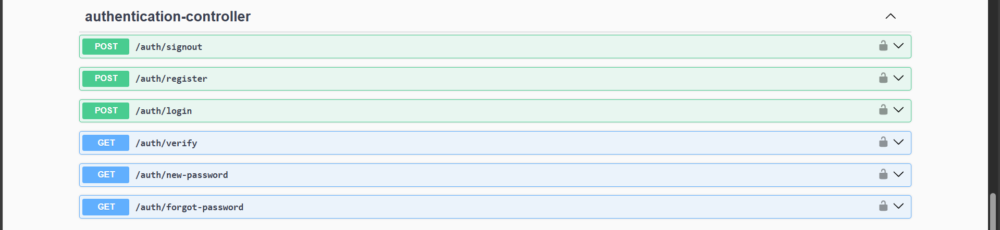
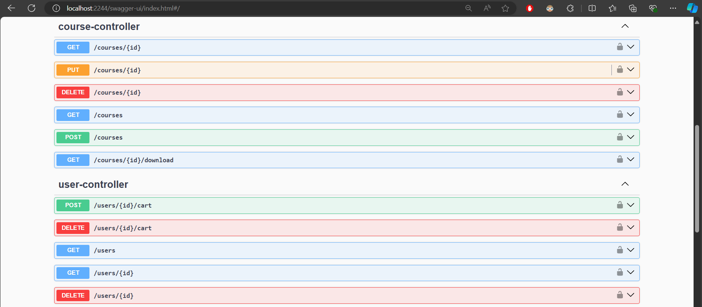
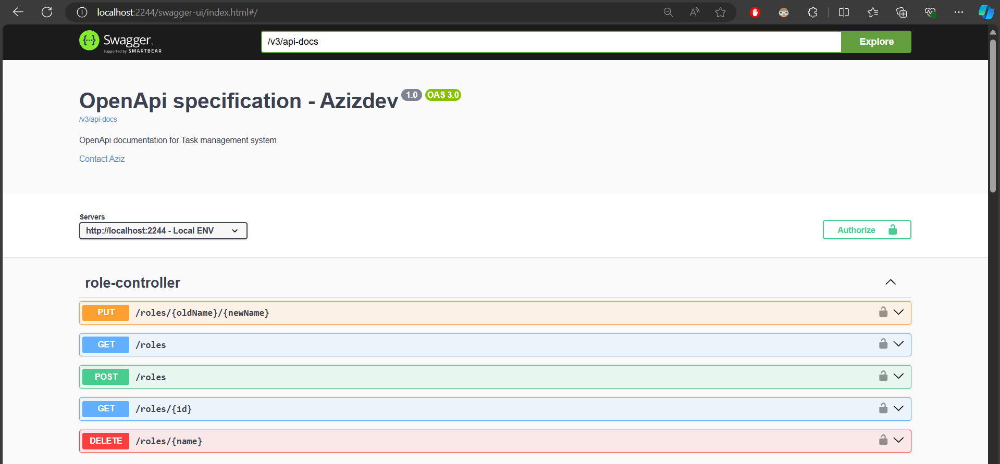
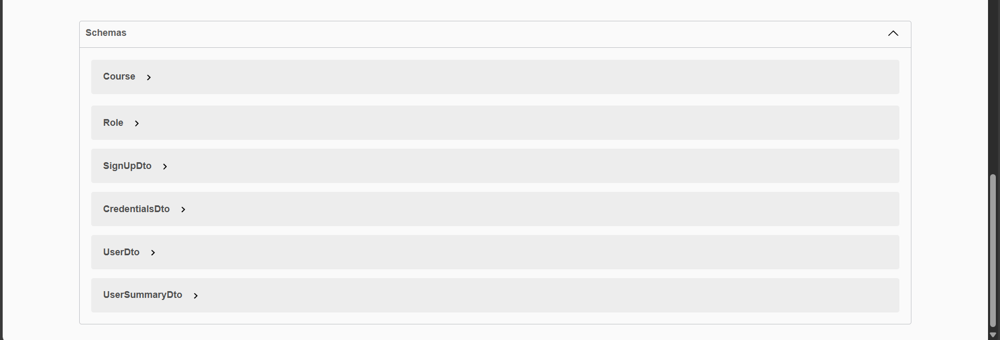

This is the course project.
    Used Java 17, Spring Boot 3.3.2 and PostgreSQL 16.2

Enter your gmail account and go to Manage Google Account. Then search for App passwords and hit the App passwords. Then create an app name then google gives code to you. Remember your app name and that code.
You should add those email name and the code to application-dev.yml file.

